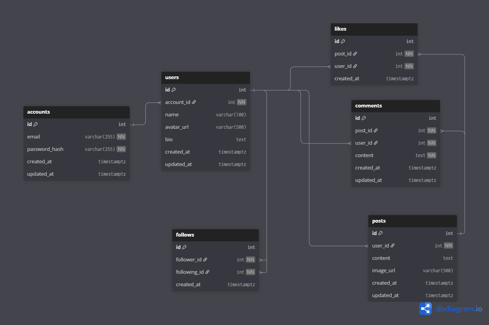
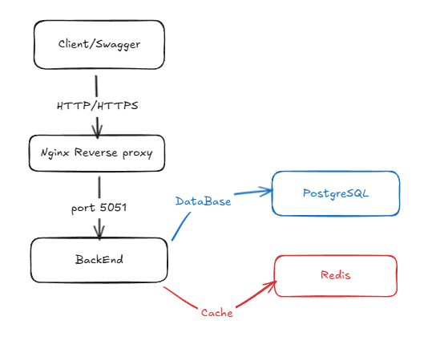

# Media Social Application - backend

Aplikasi Backend Media Sosial Yang di bangun mengunakan bahasa pemrograman Go dengan framework Gin. Proyek ini menerapkan arsitektur berlapis(Layered Architecture) untuk memastikan kode bersih, mudah di pelihara dan skalabel.

## Fitur Utama
- **Authentikasi Dan Authorisasi**: Menggunakan JWT (JSON Web Token)
- **Manajeman Profil**: Pengelolaan Data Pengguna
- **Cache**: Optimasi performa dengan Redis
- **Dokumentasi API**: Terintegrasi Dengan Swagger UI
- **Docker**: Deployment Mengunakan Docker

## Tech Stack
- **Bahasa** [Go (Golang)](https://go.dev/)
- **Framework** [Gin Gonic](https://gin-gonic.com/)
- **Database** [PostgreSQL](https://www.postgresql.org/)
- **Cache** [Redis](https://redis.io/)
- **Api Docs** [Swaggerr](https://github.com/swaggo/swag)
- **Containerization** [Docker](https://www.docker.com/)

---

### 1.Yang Harus Di Install:
- Go
- Docker
- PostgreSQL Dan Redis

### 2. Environment
Salin File  `.env.example` lalu sesuaikan konfigurasinya

```env
DB_USER=youruser
DB_PASS=yourpassword
DB_HOST=yourhost
DB_PORT=yourport
DB_NAME=yourdbname

JWT_SECRET=yourjwtsecret
JWT_ISSUER=yourjwtissuer

RDS_USER=yourredisuser
RDS_PASS=yourpasswordredis
RDS_DTBS=yourdtbs
RDS_HOST=yourredishost
RDS_PORT=yourredisport
```

### Menjalankan Aplikasi
#### Mejalankan Secara Lokal
```bash
go mod tidy

go run cmd/main.go
```
#### Menjalankkan Dengan Docker
```bash
docker compose up
```
Aplikasi Berjalan Di port 5051

---

## Test Api
Anda Dapat menguji enpoint mengunakan Swagger UI yang sudah tersedia:
- **URL**: [http://localhost:5051/swagger/index.html](http://localhost:5051/swagger/index.html)

Untuk endpoint Yang memerlukan autentikasi:
1. Klik tombol **Authorize**
2. Masukan Token Dengan Format: `Bearer <Token>`
---

## Arsitektur Project
### Struktur Project
```text
├── cmd/                Entry point aplikasi (main.go)
├── docs/               Dokumentasi Swagger
├── internal/           Logika bisnis internal
│   ├── config/         Konfigurasi DB & Redis
│   ├── controller/     Handler HTTP / Request handling
│   ├── dto/            Data Transfer Objects
│   ├── middleware/     Middleware (JWT, CORS, dll)
│   ├── model/          Struct Database
│   ├── repository/     Akses Data / Query Database
│   ├── router/         Definisi Rute API
│   └── service/        Logika Bisnis Utama
├── pkg/                Library utilitas
├── public/             Static files
└── uploads/            Direktori untuk file upload
```

### Penjelasan Arsitektur
Proyek ini menggunakan **Layered Architecture**:
1. **Controller**: Menerima request dari user dan memberikan response.
2. **Service**: Berisi logika bisnis utama (validasi, perhitungan).
3. **Repository**: Berinteraksi langsung dengan database.
4. **Model/DTO**: Mendefinisikan struktur data.

### Skema Database (ERD)


### System Design
